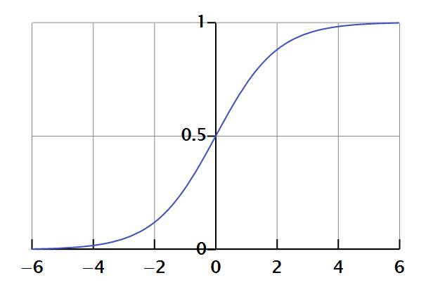

sigmoid是一个S型函数，它的函数图像如下

可以看到他是一个单调递增函数，值域是[0,1]，函数定义为
$$
f(t)=\frac1{1+e^{-t}}  \tag{1}
$$
在机器学习中，sigmoid常作为激活函数或者非线性变换函数，首先看看它的导数
$$
f'(t)=(\frac1{1+e^{-t}})'=\frac{1}{1+e^{-t}}*\frac{e^{-t}}{1+e^{-t}}=(1-f(t))f(t)    \tag{2}
$$
再来看看它的其他性质
$$f(-t)=\frac1{1+e^{t}}=\frac{e^t}{1+e^{-t}}=1-f(t) \tag{3}$$
$$\Rightarrow f(t)+f(-t)==1$$

因为它的值域是[0,1]，因此这个函数常用来定义概率分布函数，对于分类问题，如果定义属于某个类别的概率是$f(x)$，则可以用极大似然估计来求得参数值，例如对于二分类，假设$y\in(0,1)$，则似然函数为
$$S(x)=f(x)^y(1-f(x))^{1-y} \tag{4}$$
对似然函数取log后得
$$log(S(x))=ylog(f(x))+(1-y)log(1-f(x)) \tag{5}$$，化简得

$$log(S(x))=ylog(f(x))+(1-y)log(1-f(x)) $$
$$\Rightarrow log(S(x))=y[log(f(x))-log(1-f(x))] + log(1-f(x)) \tag{6}$$
$$\Rightarrow log(S(x))=ylog(\frac {f(x)}{1-f(x)})+ log(1-f(x)) \tag{7} $$
$$\Rightarrow log(S(x))=yw^Tx-log(1+e^{w^Tx}) \tag{8}$$

而如果假设$y\in(-1,1)$，则有$\frac{1+y}{2}\in(0,1)$，同理有
$$log(S(x))=\frac{1+y}{2}w^Tx-log(1+e^{w^Tx}) \tag{9}$$
如果$y=1$，则有
$$log(S(x))=w^Tx-log(1+e^{w^Tx})=-log(1+e^{-w^Tx})  \tag{10}$$
如果$y=-1$，则有
$$log(S(x))=-log(1+e^{w^Tx}) \tag{11}$$
因此，损失对数损失函数可以写为
$$log(S(x))=-log(1+e^{-yw^Tx}) \tag{12}$$

对于$y\in(0,1)$和$y\in(-1,1)$损失函数的形式，也可以这样推导
首先对于$y\in(0,1)$，有概率公式
$$
\begin{aligned}
\mathbb{P}(y=1|z) & =\sigma(z)=\frac{1}{1+e^{-z}}\\
\mathbb{P}(y=0|z) & =1-\sigma(z)=\frac{1}{1+e^{z}}\\
\end{aligned} \tag{13}
$$

如果不考虑y的取值，可以写成
$$\mathbb{P}(y|z)  =\sigma(z)^y(1-\sigma(z))^{1-y} \tag{14}$$
而由于sigmoid的性质，$1-\sigma(z)=\sigma(-z)$，因此，如果$y\in(-1,1)$，在不考虑y的取值时，概率分布函数可以写成
$$
\mathbb{P}(y|z)=\sigma(yz) \tag{15}
$$
即概率分布函数可以写成
$$\mathbb{P}(y|z)  =\frac{1}{1+e^{-yz}} \tag{16}$$

softmax对应的概率公式及求导
-------------------------
上边说的logloss是二分类的损失函数，也就是逻辑回归用的损失函数，而对于多分类的情形，需要用softmax，相应的概率密度函数也要做相应的修改，如下：
假设分类为$m$类，对于每一类有一个$n$维的参数，即对于$Y=k$，它的参数为$w_{k1},w_{k2},\cdots,w_{kn}$，则定义它的概率密度函数为：

$$\mathbb{P}(Y=j|x) = \frac{e^{W_jX}}{\sum_{i=1}^{m}e^{W_iX}}$$，其中$$W_jX=w_{j1}x_1+w_{j2}x_2+\cdots+w_{jn}x_n$$，
对于softmax，通常用logloss损失函数，公式为
$$L(y,y')=\sum_{1}^{m}{-y_{i}log(y’_{i})}$$
y为$(m,1)$的列向量，假设一个样本为i类，则$y=[0,0,\cdots,1,\cdots,0]$,第$i$维为1

下面讨论导数,假设样本为$i$类，则有对于$j=i$，求导得
$$
f'(W_jX)=-\frac{1}{f(W_iX)}\frac{\partial_{\mathbb{P}(Y=j|x)}}{\partial_{Wj}}
=-\frac{1}{f(W_iX)}(\frac{e^{W_jX}*X}{\sum_{i=1}^{k}e^{W_{i}X}}-\frac{e^{W_jX}*e^{W_jX}*X}{\left (\sum_{i=1}^{k}e^{W_iX} \right)^2})
=(f(W_jX-1)X
$$
而对于$j != i$的情况，
$$
f'(W_jX)=-\frac{1}{f(W_iX)}\frac{\partial_{\mathbb{P}(Y=i|x)}}{\partial_{Wj}}
=-\frac{1}{f(W_iX)}(-\frac{e^{W_jX}*e^{W_iX}*X}{\left (\sum_{i=1}^{k}e^{W_iX} \right)^2})
=f(W_jX)X
$$
我们注意到$y_i=1,y_j=0$,因此可以写成通用的格式，即
$$
f'(W_iX)=(f(W_iX)-y_i)X
$$
可以看到，跟二分类的逻辑回归是一致的。