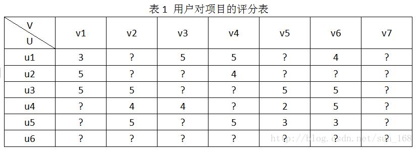

简介
----

推荐算法是推荐系统的核心，推荐算法可以分为如下几类:    

* 基于内容的推荐    
* 基于协同过滤推荐    
* 基于关联规则的推荐    
* 混合推荐    

#####基于内容的推荐#####
基于内容推荐(Content-based Recommendations)是很早的一种推荐方法，他是基于item特征和用户profile来建模，也就是根据item基础属性及历史数据抽取item的行为特征，根据用户历史行为数据（例如评价、分享、点赞等行为）抽取用户的profile数据，然后根据item和用户特征，为用户推荐一组相关性最大的item。

[举个例子][1] ,对于个性化阅读来说，一个item就是一篇文章。根据上面的第一步，我们首先要从文章内容中抽取出代表它们的属性。常用的方法就是利用出现在一篇文章中词来代表这篇文章，而每个词对应的权重往往使用信息检索中的tf-idf来计算。比如对于本文来说，词“CB”、“推荐”和“喜好”的权重会比较大，而“烤肉”这个词的权重会比较低。利用这种方法，一篇抽象的文章就可以使用具体的一个向量来表示了。第二步就是根据用户过去喜欢什么文章来产生刻画此用户喜好的 profile了，最简单的方法可以把用户所有喜欢的文章对应的向量的平均值作为此用户的profile。比如某个用户经常关注与推荐系统有关的文章，那么他的profile中“CB”、“CF”和“推荐”对应的权重值就会较高。在获得了一个用户的profile后，CB就可以利用所有item与此用户profile的相关度对他进行推荐文章了。一个常用的相关度计算方法是cosine。最终把候选item里与此用户最相关（cosine值最大）的N个item作为推荐返回给此用户。举个例子说明前面的三个步骤。对于个性化阅读来说，一个item就是一篇文章。根据上面的第一步，我们首先要从文章内容中抽取出代表它们的属性。常用的方法就是利用出现在一篇文章中词来代表这篇文章，而每个词对应的权重往往使用信息检索中的tf-idf来计算。比如对于本文来说，词“CB”、“推荐”和“喜好”的权重会比较大，而“烤肉”这个词的权重会比较低。利用这种方法，一篇抽象的文章就可以使用具体的一个向量来表示了。第二步就是根据用户过去喜欢什么文章来产生刻画此用户喜好的 profile了，最简单的方法可以把用户所有喜欢的文章对应的向量的平均值作为此用户的profile。比如某个用户经常关注与推荐系统有关的文章，那么他的profile中“CB”、“CF”和“推荐”对应的权重值就会较高。在获得了一个用户的profile后，CB就可以利用所有item与此用户profile的相关度对他进行推荐文章了。一个常用的相关度计算方法是cosine。最终把候选item里与此用户最相关（cosine值最大）的N个item作为推荐返回给此用户。

有了特征，就可以应用监督学习来学习一个模型，使用这个模型对item进行打分，选出最大的几个item来作为推荐结果，大部分监督学习算法都可以应用到这里，如线性回归，逻辑回归，决策树等

#####基于协同过滤推荐#####

协同过滤（ CF）推荐算法通过在用户活动中寻找特定模式来为用户产生有效推荐。它依赖于系统中用户的惯用数据，例如通过用户对其阅读过书籍的评价可以推断出用户的阅读偏好。这种算法的核心思想就是：如果两个用户对于一些项的评分相似程度较高，那么一个用户对于一个新项的评分很有可能类似于另一个用户。值得注意的是，他们推荐的时候不依赖于项的任何附加信息（ 例如描述、元数据等等）或者用户的任何附加信息（例如喜好、人口统计相关数据等等）。 CF 的方法大体可分为两类：分别为邻域和基于模型的方法。邻域方法（即基于内存的 CF）是使用用户对已有项的评分直接预测该用户对新项的评分。与之相反，基于模型的方法是使用历史评分数据，基于学习出的预测模型，预测对新项的评分。通常的方式是使用机器学习算法，找出用户与项的相互作用模型，从而找出数据中的特定模式。

#####基于关联规则的推荐#####

基于关联规则的推荐（Association Rule-based Recommendation）是以关联规则为基础，把已购商品作为规则头，规则体为推荐对象。关联规则挖掘可以发现不同商品在销售过程中的相关性，在零售业中已经得到了成功的应用。管理规则就是在一个交易数据库中统计购买了商品集X的交易中有多大比例的交易同时购买了商品集Y，其直观的意义就是用户在购买某些商品的时候有多大倾向去购买另外一些商品。比如购买牛奶的同时很多人会同时购买面包。
#####混合推荐#####
[由于各种推荐方法][2]都有优缺点，所以在实际中，组合推荐（Hybrid Recommendation）经常被采用。研究和应用最多的是内容推荐和协同过滤推荐的组合。最简单的做法就是分别用基于内容的方法和协同过滤推荐方法去产生一个推荐预测结果，然后用某方法组合其结果。尽管从理论上有很多种推荐组合方法，但在某一具体问题中并不见得都有效，组合推荐一个最重要原则就是通过组合后要能避免或弥补各自推荐技术的弱点。
在组合方式上，有研究人员提出了七种组合思路：
1）加权（Weight）：加权多种推荐技术结果。
2）变换（Switch）：根据问题背景和实际情况或要求决定变换采用不同的推荐技术。
3）混合（Mixed）：同时采用多种推荐技术给出多种推荐结果为用户提供参考。
4）特征组合（Feature combination）：组合来自不同推荐数据源的特征被另一种推荐算法所采用。
5）层叠（Cascade）：先用一种推荐技术产生一种粗糙的推荐结果，第二种推荐技术在此推荐结果的基础上进一步作出更精确的推荐。
6）特征扩充（Feature augmentation）：一种技术产生附加的特征信息嵌入到另一种推荐技术的特征输入中。
7）元级别（Meta-level）：用一种推荐方法产生的模型作为另一种推荐方法的输入。

#####矩阵分解在推荐系统的应用#####
在推荐系统中，我们常常遇到的问题是这样的，我们有很多用户和物品，也有少部分用户对少部分物品的评分，我们希望预测目标用户对其他未评分物品的评分，进而将评分高的物品推荐给目标用户。比如下面的用户物品评分表：

协同过滤算法的思想是找用户相似的或者item相似的来做推荐，而矩阵分解的思想是通过一种方法计算出未知的评分，推荐系统基于这样一个假设：用户对项目的打分越高，表明用户越喜欢。因此，预测出用户对未评分项目的评分后，根据分值大小排序，把分值高的项目推荐给用户。

任何矩阵都可以进行奇异值分解，即对于一个$m*n$矩阵，都有

$$M_{m \times n}=U_{m \times k}\Sigma_{k \times k}V_{k \times n}^T \tag{1}$$

这样我们来求第i个用户对第j个物品的评分$m_{ij}$，只需要计算$u_i^T\Sigma v_j$，就可以得到得分。这里的前提是已经对矩阵做了分解，而奇异值分解要求矩阵不能有缺省值，因此最初始的解决方法是对缺失值填一个$0$或者一个全局平均值。实际在推荐系统中用到的矩阵分解是一个伪奇异值分解，它假设对矩阵$M$分解为两个矩阵乘积，即

$$M_{m \times n}=P_{m \times k}^TQ_{k \times n} \tag{2}$$

两个矩阵分别叫用户到隐因子的对应矩阵$P$，和item到隐因子的对应矩阵$Q$。例如假设有$k$个隐因子，用户到隐因子的对应矩阵$P$的每一行表示用户对每个隐因子的喜好程度，item到隐因子的对应矩阵$Q$表示当前item属于这个隐因子的比重，则用户对一个item的评分可以用两个矩阵行列的点积来求得，其实在推荐系统中的矩阵分解就是隐因子模型    

怎么求解这两个矩阵？采用均方差作为损失函数，对于任意一个评分$\hat{m}_{ij}$，有$\hat{m}_{ij}=q_j^Tp_i$，因此均方误差的定义为

$$L=\sum\limits_{i,j}(m_{ij}-q_j^Tp_i)^2 \tag{3}$$

最小化均方误差，就可以求出两个矩阵，这样就可以矩阵的缺省值进行预测，这就是BASIC SVD算法

为了防止过拟合，加入$L2$正则，即损失函数定义为

$$L=\underbrace{arg\;min}_{p_i,q_j}\;\sum\limits_{i,j}(m_{ij}-q_j^Tp_i)^2 + \lambda(||p_i||_2^2 + ||q_j||_2^2 ) \tag{4}$$

通过梯度下降法来求，迭代公式为：

$$\frac{\partial J}{\partial p_i} = -2(m_{ij}-q_j^Tp_i)q_j + 2\lambda p_i \tag{5}$$
$$\frac{\partial J}{\partial q_j} = -2(m_{ij}-q_j^Tp_i)p_i + 2\lambda q_j \tag{6}$$
$$p_i = p_i + \alpha((m_{ij}-q_j^Tp_i)q_j - \lambda p_i) \tag{7}$$
$$q_j =q_j +  \alpha((m_{ij}-q_j^Tp_i)p_i - \lambda q_j) \tag{8}$$

加入正则化的模型叫RSVD

每个用户对item的评分取决于用户评分的习惯和item的质量，例如一个用户就是喜欢对item打高分，同时item的质量不一样，item质量高的就能得到用户的高的评分，因此加入用户的偏置和物品的偏置，即定义

$$\hat{m}_{ij}=\mu+b_u+b_i+q_j^Tp_i \tag{9}$$

其中，$\mu$是全局平均分，在不同网站中，因为网站定位和销售的物品不同，网站的整体评分分布也会显示出一些差异。比如有些网站中的用户就是喜欢打高分，而另一些网站的用户就是喜欢打低分。而全局平均数可以表示网站本身对用户评分的影响。$b_u$是用户$u$的偏置项，这一项表示了用户的评分习惯中和物品没有关系的那种因素。比如有些用户就是比较苛刻，对什么东西要求都很高，那么他的评分就会偏低，而有些用户比较宽容，对什么东西都觉得不错，那么他的评分就会偏高。$b_i$是item的偏置项，这一项表示了物品接受的评分中和用户没有什么关系的因素。比如有些物品本身质量就很高，因此获得的评分相对都比较高，而有些物品本身质量很差，因此获得的评分相对都会比较低。同样对偏置加上$L2$正则，则加入偏置后，损失函数变为：

$$L=\underbrace{arg\;min}_{p_i,q_j}\;\sum\limits_{i,j}(m_{ij}-\mu-b_i-b_j-q_j^Tp_i)^2 + \lambda(||p_i||_2^2 + ||q_j||_2^2 + ||b_i||_2^2 + ||b_j||_2^2) \tag{10}$$

$p_i,q_j$的迭代公式不变，而$b_u,b_j$的迭代公式为

$$b_i = b_i + \alpha(m_{ij}-\mu-b_i-b_j-q_j^Tp_i -\lambda b_i) \tag{11}$$
$$b_j = b_j + \alpha(m_{ij}-\mu-b_i-b_j-q_j^Tp_i -\lambda b_j) \tag{12}$$

加入偏置的模型叫BSVD

矩阵分解将矩阵分解为两个隐因子矩阵，很好的考虑了用户整体的关系，而没有考虑用户邻域之间的关系，而item-base协同过滤很好的考虑了用户的邻域关系，因此可以将两个模型融合。

融合后的模型的损失函数定义为
$$\underbrace{arg\;min}_{p_i,q_j}\;\sum\limits_{i,j}(m_{ij}-\mu-b_i-b_j-q_j^Tp_i - q_j^T|N(i)|^{-1/2}\sum\limits_{s \in N(i)}y_{s})^2+ \\ 
\lambda(||p_i||_2^2 + ||q_j||_2^2 + ||b_i||_2^2 + ||b_j||_2^2 + \sum\limits_{s \in N(i)}||y_{s}||_2^2)$$

这个模型称为SVD++

#####参考文献#####
[1]: http://www.cnblogs.com/breezedeus/archive/2012/04/10/2440488.html
[2]: http://blog.sina.com.cn/s/blog_602feaa80100fjq9.html
